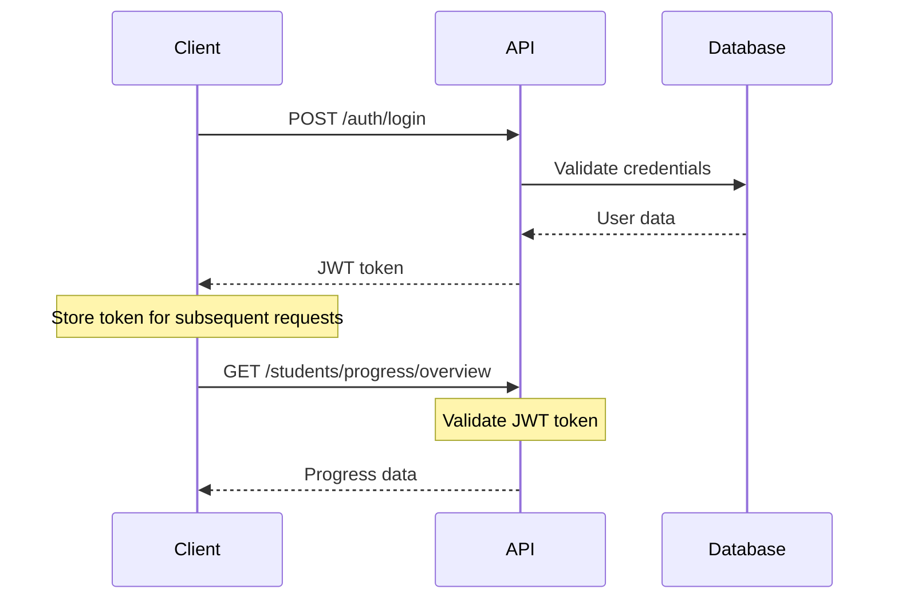
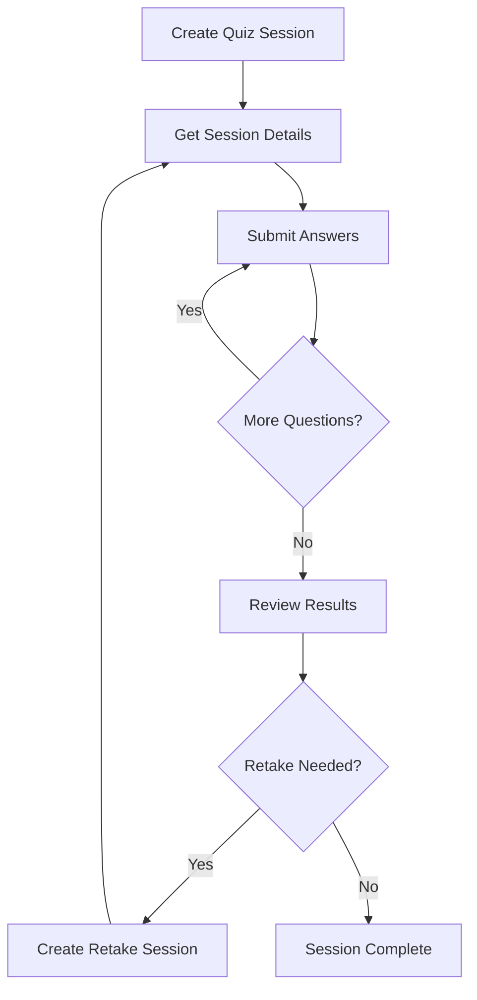

# 📚 Student API Complete Documentation

## 🎯 API Overview

**Base URL:** `next_public_api_base_url/api/v1`  
**Authentication:** Bearer Token (JWT)  
**Version:** 2.0.0

---

## 🔐 Authentication Endpoints

| Method | Endpoint | Description | Auth Required |
|--------|----------|-------------|---------------|
| `POST` | `/auth/login` | Student/Admin login | ❌ |

### Login Request Body
```json
{
  "email": "test@example.com",
  "password": "password123"
}
```

### Response Format
```json
{
  "success": true,
  "data": {
    "accessToken": "eyJhbGciOiJIUzI1NiIsInR5cCI6IkpXVCJ9...",
    "user": {
      "id": 6,
      "email": "test@example.com",
      "role": "STUDENT"
    }
  }
}
```

---

## 📚 Content Access (Public Endpoints)

| Method | Endpoint | Description | Parameters |
|--------|----------|-------------|------------|
| `GET` | `/universities` | Get all universities | None |
| `GET` | `/specialties` | Get all specialties | None |
| `GET` | `/study-packs` | Get all study packs | None |
| `GET` | `/study-packs/{id}` | Get specific study pack | `id` (path) |

### Universities Response Example
```json
{
  "success": true,
  "data": [
    {
      "id": 4,
      "name": "University of Medicine",
      "code": "UMED",
      "location": "Algiers"
    }
  ]
}
```

---

## 📊 Student Progress & Analytics

### 📈 Progress Tracking

| Method | Endpoint | Description | Parameters |
|--------|----------|-------------|------------|
| `GET` | `/students/progress/overview` | Complete progress overview | None |
| `PUT` | `/students/courses/{courseId}/progress` | Update course progress | `courseId` (path) |

#### Update Progress Request Body
```json
{
  "layer": 2,
  "completed": true
}
```

### 📋 Quiz & Session History

| Method | Endpoint | Description | Query Parameters |
|--------|----------|-------------|------------------|
| `GET` | `/students/quiz-history` | Get quiz history | `type`, `page`, `limit` |
| `GET` | `/students/session-results` | Get session results | `answerType`, `page`, `limit` |
| `GET` | `/students/available-sessions` | Get available sessions | `sessionType` |

#### Query Parameters Reference

| Parameter | Values | Default | Description |
|-----------|--------|---------|-------------|
| `type` | `PRACTICE`, `EXAM` | All | Filter by quiz type |
| `answerType` | `all`, `correct`, `incorrect` | `all` | Filter by answer type |
| `sessionType` | `PRACTICE`, `EXAM` | All | Filter by session type |
| `page` | Integer | 1 | Page number |
| `limit` | Integer | 10 | Items per page |

### 🎯 Dashboard Performance

| Method | Endpoint | Description | Response Data |
|--------|----------|-------------|---------------|
| `GET` | `/students/dashboard/performance` | Key performance metrics | Stats, trends, scores |

#### Performance Response Structure
```json
{
  "success": true,
  "data": {
    "totalQuizzes": 45,
    "averageScore": 78.5,
    "completionRate": 92.3,
    "streak": 7,
    "weeklyProgress": [65, 72, 78, 81, 78, 83, 85],
    "topSubjects": ["Anatomy", "Physiology", "Biochemistry"],
    "weakAreas": ["Pharmacology", "Pathology"]
  }
}
```

---

## 🧠 Quiz Management System

### 🔧 Quiz Configuration

| Method | Endpoint | Description | Purpose |
|--------|----------|-------------|---------|
| `GET` | `/quizzes/quiz-filters` | Get filter options | Configure quiz creation |

### 🎮 Quiz Sessions

| Method | Endpoint | Description | Request Body Required |
|--------|----------|-------------|----------------------|
| `POST` | `/quizzes/quiz-sessions` | Create new quiz session | ✅ |
| `GET` | `/students/quiz-sessions` | Get user's quiz sessions | ❌ |
| `GET` | `/students/quiz-sessions/{sessionId}` | Get session details | ❌ |

#### Create Quiz Session Request
```json
{
  "title": "Practice Quiz Session - Anatomy",
  "quizType": "PRACTICE",
  "settings": {
    "questionCount": 10,
    "timeLimit": 1800,
    "shuffleQuestions": true
  },
  "filters": {
    "yearLevels": ["ONE", "TWO"],
    "courseIds": [10, 12, 15],
    "questionTypes": ["SINGLE_CHOICE", "MULTIPLE_CHOICE"],
    "difficulty": ["EASY", "MEDIUM"]
  }
}
```

### ✍️ Answer Management

| Method | Endpoint | Description | Use Case |
|--------|----------|-------------|----------|
| `POST` | `/students/quiz-sessions/{sessionId}/submit-answer` | Submit answers | Initial submission |
| `PUT` | `/students/quiz-sessions/{sessionId}/questions/{questionId}/answer` | Update answer | Change answer |

#### Submit Answer Request
```json
{
  "answers": [
    {
      "questionId": 54,
      "selectedAnswerId": 189,
      "timeSpent": 45
    },
    {
      "questionId": 55,
      "selectedAnswerId": 192,
      "timeSpent": 32
    }
  ]
}
```

### 🔄 Retake System

| Method | Endpoint | Description | Retake Types |
|--------|----------|-------------|--------------|
| `POST` | `/quiz-sessions/retake` | Create retake session | `ALL_QUESTIONS`, `INCORRECT_ONLY` |

---

## 📝 Exam Management System

### 📋 Exam Access

| Method | Endpoint | Description | Access Level |
|--------|----------|-------------|--------------|
| `GET` | `/exams/available` | Get available exams | Student enrolled |
| `GET` | `/exams/{examId}` | Get exam details | Public |
| `GET` | `/exams/{examId}/questions` | Get exam questions | Authenticated |
| `GET` | `/exams/by-module/{moduleId}/{year}` | Get exams by module/year | Public |

### 🎯 Exam Sessions

| Method | Endpoint | Description | Session Type |
|--------|----------|-------------|--------------|
| `POST` | `/exams/exam-sessions` | Create single exam session | Standard |
| `POST` | `/exams/exam-sessions/from-modules` | Create multi-module session | Custom |

#### Multi-Module Exam Request
```json
{
  "moduleIds": [12, 15, 18],
  "questionCount": 50,
  "title": "Comprehensive Mid-Term Exam",
  "timeLimit": 7200,
  "settings": {
    "shuffleQuestions": true,
    "showResults": false,
    "allowReview": true
  }
}
```

---

## 👨‍🎓 Student Features

### 💳 Subscription Management

| Method | Endpoint | Description | Data Included |
|--------|----------|-------------|---------------|
| `GET` | `/students/subscriptions` | Get subscription status | Plan, expiry, features |

### 📚 Course Resources

| Method | Endpoint | Description | Resource Types |
|--------|----------|-------------|----------------|
| `GET` | `/courses/{courseId}/resources` | Get course resources | PDFs, videos, slides |

#### Resources Response Structure
```json
{
  "success": true,
  "data": {
    "resources": [
      {
        "id": 1,
        "title": "Anatomy Chapter 1 - Introduction",
        "type": "PDF",
        "size": "2.5MB",
        "downloadUrl": "/resources/download/1",
        "createdAt": "2024-01-15T10:00:00Z"
      },
      {
        "id": 2,
        "title": "Heart Anatomy Video Lecture",
        "type": "VIDEO",
        "duration": "45:30",
        "streamUrl": "/resources/stream/2",
        "createdAt": "2024-01-16T14:30:00Z"
      }
    ]
  }
}
```

---

## 📝 Student Notes System

### 📋 Notes Management

| Method | Endpoint | Description | Scope |
|--------|----------|-------------|-------|
| `GET` | `/students/notes` | Get all student notes | All notes |
| `GET` | `/students/questions/{questionId}/notes` | Get notes for question | Question-specific |
| `POST` | `/students/notes` | Create new note | Create |
| `PUT` | `/students/notes/{noteId}` | Update existing note | Update |
| `DELETE` | `/students/notes/{noteId}` | Delete note | Delete |

#### Create Note Request
```json
{
  "noteText": "Remember: The heart has 4 chambers - 2 atria and 2 ventricles",
  "questionId": 54,
  "tags": ["anatomy", "cardiology", "important"],
  "isPrivate": true
}
```

#### Notes Response Example
```json
{
  "success": true,
  "data": [
    {
      "id": 1,
      "noteText": "Important concept for exam",
      "questionId": 54,
      "questionTitle": "Heart Anatomy - Chambers",
      "tags": ["anatomy", "cardiology"],
      "createdAt": "2024-08-08T10:30:00Z",
      "updatedAt": "2024-08-08T10:30:00Z"
    }
  ]
}
```

---

## 🏷️ Labeling System

### 🏷️ Label Management

| Method | Endpoint | Description | Purpose |
|--------|----------|-------------|---------|
| `GET` | `/students/labels` | Get all labels | Organization |
| `POST` | `/students/labels` | Create new label | Categorization |
| `PUT` | `/students/labels/{labelId}` | Update label | Modification |
| `DELETE` | `/students/labels/{labelId}` | Delete label | Cleanup |

### 🔗 Content Association

| Method | Endpoint | Description | Association Type |
|--------|----------|-------------|------------------|
| `POST` | `/students/quizzes/{quizId}/labels/{labelId}` | Add quiz to label | Quiz labeling |
| `POST` | `/students/quiz-sessions/{sessionId}/labels/{labelId}` | Add session to label | Session labeling |

#### Label Structure
```json
{
  "id": 1,
  "name": "High Priority Topics",
  "color": "#FF5733",
  "createdAt": "2024-08-01T12:00:00Z",
  "associatedContent": {
    "quizzes": 5,
    "sessions": 8,
    "questions": 23
  }
}
```

---

## ✅ Todo & Task Management

### 📋 Task Operations

| Method | Endpoint | Description | Status Management |
|--------|----------|-------------|-------------------|
| `GET` | `/students/todos` | Get paginated todos | View all |
| `POST` | `/students/todos` | Create new todo | Add task |
| `PUT` | `/students/todos/{todoId}` | Update todo details | Modify |
| `PUT` | `/students/todos/{todoId}/complete` | Mark as completed | Complete |
| `DELETE` | `/students/todos/{todoId}` | Delete todo | Remove |

### 📊 Todo Categories & Priorities

| Type | Priority | Status | Description |
|------|----------|--------|-------------|
| `STUDY` | `HIGH` | `PENDING` | Study-related tasks |
| `QUIZ` | `MEDIUM` | `IN_PROGRESS` | Quiz preparation |
| `EXAM` | `LOW` | `COMPLETED` | Exam preparation |
| `REVIEW` | `URGENT` | `OVERDUE` | Content review |

#### Create Todo Request
```json
{
  "title": "Review Cardiovascular System",
  "description": "Focus on heart anatomy and blood circulation",
  "type": "STUDY",
  "priority": "HIGH",
  "dueDate": "2024-08-15T23:59:59Z",
  "courseId": 10,
  "estimatedTime": 120,
  "tags": ["anatomy", "cardiology", "exam-prep"]
}
```

---

## 🚨 Question Reporting System

### 📝 Report Management

| Method | Endpoint | Description | Report Types |
|--------|----------|-------------|--------------|
| `POST` | `/students/questions/{questionId}/report` | Create report | Issue reporting |
| `GET` | `/students/reports` | Get user reports | View submissions |
| `GET` | `/students/reports/{reportId}` | Get report details | Detailed view |

### 🔍 Report Categories

| Report Type | Severity | Processing Time | Description |
|-------------|----------|-----------------|-------------|
| `INCORRECT_ANSWER` | High | 24-48 hours | Wrong correct answer |
| `TYPO` | Low | 1-3 days | Spelling/grammar errors |
| `UNCLEAR_QUESTION` | Medium | 2-5 days | Ambiguous wording |
| `TECHNICAL_ISSUE` | High | 12-24 hours | System/display problems |
| `INAPPROPRIATE_CONTENT` | Critical | 2-6 hours | Content violations |

#### Create Report Request
```json
{
  "reportType": "INCORRECT_ANSWER",
  "description": "According to Gray's Anatomy textbook (Chapter 15, Page 234), the correct answer should be option B, not option A.",
  "severity": "HIGH",
  "additionalInfo": {
    "textbookReference": "Gray's Anatomy - Chapter 15, Page 234",
    "expectedAnswer": "Option B",
    "currentAnswer": "Option A"
  }
}
```

---

## 📊 API Response Patterns

### ✅ Success Response Format
```json
{
  "success": true,
  "data": { /* response data */ },
  "message": "Operation completed successfully",
  "timestamp": "2024-08-08T10:30:00Z"
}
```

### ❌ Error Response Format
```json
{
  "success": false,
  "error": {
    "code": "VALIDATION_ERROR",
    "message": "Invalid input parameters",
    "details": [
      {
        "field": "email",
        "message": "Invalid email format"
      }
    ]
  },
  "timestamp": "2024-08-08T10:30:00Z"
}
```

### 📄 Paginated Response Format
```json
{
  "success": true,
  "data": { /* paginated items */ },
  "pagination": {
    "currentPage": 1,
    "totalPages": 5,
    "totalItems": 47,
    "itemsPerPage": 10,
    "hasNext": true,
    "hasPrev": false
  }
}
```

---

## 🔧 Environment Variables

| Variable | Example Value | Description |
|----------|---------------|-------------|
| `{{baseUrl}}` | `http://localhost:3005/api/v1` | API base URL |
| `{{studentToken}}` | `eyJhbGciOiJIUzI1NiIs...` | Student JWT token |
| `{{adminToken}}` | `eyJhbGciOiJIUzI1NiIs...` | Admin JWT token |
| `{{studentId}}` | `6` | Test student ID |
| `{{courseId}}` | `10` | Test course ID |
| `{{questionId}}` | `54` | Test question ID |
| `{{sessionId}}` | `35` | Test session ID |

---

## 🚀 Quick Start Guide

### 1. Authentication Flow


### 2. Quiz Session Workflow


### 3. Common Usage Patterns

#### Pattern 1: Daily Study Session
```bash
# 1. Login
POST /auth/login

# 2. Check progress
GET /students/progress/overview

# 3. Get available sessions
GET /students/available-sessions?sessionType=PRACTICE

# 4. Create quiz session
POST /quizzes/quiz-sessions

# 5. Answer questions
POST /students/quiz-sessions/{sessionId}/submit-answer

# 6. Review performance
GET /students/dashboard/performance
```

#### Pattern 2: Exam Preparation
```bash
# 1. Get exam list
GET /exams/available

# 2. Get exam details
GET /exams/{examId}

# 3. Create exam session
POST /exams/exam-sessions

# 4. Take exam
POST /students/quiz-sessions/{sessionId}/submit-answer

# 5. Add notes for review
POST /students/notes
```

---

## 📈 Performance Monitoring

### Response Time Benchmarks

| Endpoint Category | Expected Response Time | Performance Level |
|------------------|----------------------|-------------------|
| Authentication | < 200ms | Excellent |
| Content Access | < 150ms | Excellent |
| Progress Tracking | < 300ms | Good |
| Quiz Management | < 400ms | Good |
| Analytics | < 500ms | Acceptable |

### Rate Limiting

| User Type | Requests per Minute | Burst Limit |
|-----------|-------------------|-------------|
| Student | 100 | 150 |
| Admin | 200 | 300 |
| Guest | 20 | 30 |

---

*📝 Last Updated: August 8, 2025*  
*🔗 API Version: 2.0.0*  
*🌟 For support, contact: support@medcin.dz*